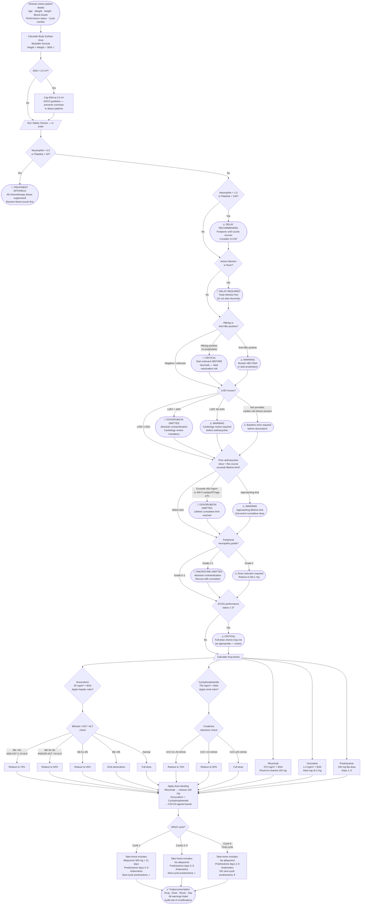

```mermaid
flowchart TD
    A([Clinician enters patient details\nAge · Weight · Height · Blood results\nPerformance status · Cycle number]) --> B

    B[Calculate Body Surface Area\nMosteller formula\nHeight × Weight ÷ 3600 √] --> C

    C{BSA > 2.0 m²?}
    C -- Yes --> D[Cap BSA at 2.0 m²\nASCO guideline — prevents overdose\nin obese patients]
    C -- No --> E

    D --> E[/Run Safety Checks — in order/]

    E --> SC1{Neutrophils < 0.5\nor Platelets < 50?}
    SC1 -- Yes --> STOP([🛑 TREATMENT WITHHELD\nAll chemotherapy doses suppressed\nResolve blood counts first])
    SC1 -- No --> SC2

    SC2{Neutrophils < 1.0\nor Platelets < 100?}
    SC2 -- Yes --> DELAY([⚠️ DELAY RECOMMENDED\nPostpone until counts recover\nConsider G-CSF])
    SC2 -- No --> SC3
    DELAY --> SC3

    SC3{Active infection\nor fever?}
    SC3 -- Yes --> INF([🛑 DELAY REQUIRED\nTreat infection first\nDo not start rituximab])
    SC3 -- No --> SC4
    INF --> SC4

    SC4{HBsAg or\nAnti-HBc positive?}
    SC4 -- HBsAg positive,\nno prophylaxis --> HBV([🛑 CRITICAL\nStart entecavir BEFORE\nrituximab — fatal reactivation risk])
    SC4 -- Anti-HBc positive --> HBV2([⚠️ WARNING\nMonitor HBV DNA\nor start prophylaxis])
    SC4 -- Negative / unknown --> SC5
    HBV --> SC5
    HBV2 --> SC5

    SC5{LVEF known?}
    SC5 -- LVEF < 40% --> LVEF1([🛑 DOXORUBICIN OMITTED\nAbsolute contraindication\nCardiology review mandatory])
    SC5 -- LVEF 40–54% --> LVEF2([⚠️ WARNING\nCardiology review required\nbefore anthracycline])
    SC5 -- LVEF ≥ 55% --> SC6
    SC5 -- Not provided,\ncardiac risk factors present --> ECHO([⚠️ Baseline echo required\nbefore doxorubicin])
    LVEF1 --> SC6
    LVEF2 --> SC6
    ECHO --> SC6

    SC6{Prior anthracycline\ndose + this course\nexceeds lifetime limit?}
    SC6 -- Exceeds 450 mg/m²\nor 400 if cardiac/RT/age ≥70 --> ANTHLIM([🛑 DOXORUBICIN OMITTED\nLifetime cumulative limit reached])
    SC6 -- Approaching limit --> ANTHWARN([⚠️ WARNING\nApproaching lifetime limit\nDocument cumulative dose])
    SC6 -- Within limit --> SC7
    ANTHLIM --> SC7
    ANTHWARN --> SC7

    SC7{Peripheral\nneuropathy grade?}
    SC7 -- Grade ≥ 3 --> VCR_OMIT([🛑 VINCRISTINE OMITTED\nAbsolute contraindication\nDiscuss with consultant])
    SC7 -- Grade 2 --> VCR_WARN([⚠️ Dose reduction required\nReduce to flat 1 mg])
    SC7 -- Grade 0–1 --> SC8
    VCR_OMIT --> SC8
    VCR_WARN --> SC8

    SC8{ECOG performance\nstatus ≥ 3?}
    SC8 -- Yes --> PS([⚠️ CRITICAL\nFull-dose chemo may not\nbe appropriate — review])
    SC8 -- No --> DOSE
    PS --> DOSE

    DOSE[/Calculate drug doses/]

    DOSE --> R[Rituximab\n375 mg/m² × BSA\nRound to nearest 100 mg]
    DOSE --> DOX{Doxorubicin\n50 mg/m² × BSA\nApply hepatic rules?}
    DOSE --> VCR[Vincristine\n1.4 mg/m² × BSA\nHard cap at 2 mg]
    DOSE --> CYC{Cyclophosphamide\n750 mg/m² × BSA\nApply renal rules?}
    DOSE --> PRED[Prednisolone\n100 mg flat dose\nDays 1–5]

    DOX --> HEPCHECK{Bilirubin / AST / ALT\ncheck}
    HEPCHECK -- Bili <30\nAND AST 2–3×ULN --> DOX75[Reduce to 75%]
    HEPCHECK -- Bili 30–50\nAND/OR AST >3×ULN --> DOX50[Reduce to 50%]
    HEPCHECK -- Bili 51–85 --> DOX25[Reduce to 25%]
    HEPCHECK -- Bili >85 --> DOX0[Omit doxorubicin]
    HEPCHECK -- Normal --> DOXFULL[Full dose]

    CYC --> RENCHECK{Creatinine\nclearance check}
    RENCHECK -- CrCl 10–20 ml/min --> CYC75[Reduce to 75%]
    RENCHECK -- CrCl <10 ml/min --> CYC50[Reduce to 50%]
    RENCHECK -- CrCl ≥20 ml/min --> CYCFULL[Full dose]

    DOX75 & DOX50 & DOX25 & DOX0 & DOXFULL --> BAND
    CYC75 & CYC50 & CYCFULL --> BAND
    R & VCR & PRED --> BAND

    BAND[Apply dose banding\nRituximab → nearest 100 mg\nDoxorubicin + Cyclophosphamide\n→ CSCCN agreed bands]

    BAND --> CYCLE{Which cycle?}

    CYCLE -- Cycle 1 --> TH1[Take-home includes:\nAllopurinol 300 mg × 21 days\nPrednisolone days 2–5\nAntiemetics\nNext-cycle prednisolone ✓]
    CYCLE -- Cycles 2–5 --> TH25[Take-home includes:\nNo allopurinol\nPrednisolone days 2–5\nAntiemetics\nNext-cycle prednisolone ✓]
    CYCLE -- Cycle 6\nFinal cycle --> TH6[Take-home includes:\nNo allopurinol\nPrednisolone days 2–5\nAntiemetics\nNO next-cycle prednisolone ✗]

    TH1 & TH25 & TH6 --> OUT

    OUT([✅ Output prescription\nDrug · Dose · Route · Day\nAll warnings listed\nAudit trail of modifications])
```
